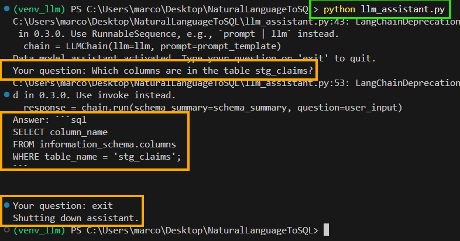

# Paso a paso
## Uso de Agente

Para este proyecto, se utilizaron dos entornos virtuales (*venv_llm y venv_dbt*) por conflicto de dependencias. Para testear nuestro agente, vamos a utilizar **venv_llm**

1. Lo primero que debemos hacer es activar nuestro entorno virtual, el cual nos provee las dependencias necesarias para correr el script. Para esto, debemos situarnos en consola dentro del directorio Raíz (NaturalLanguageToSQL). Una vez hecho esto, utilizaremos el siguiente comando en PowerShell:  
    `...\NaturalLanguageToSQL> venv_llm\Scripts\activate`
2. Una vez realizado este paso, corremos el siguiente comando para asegurarnos de que tenemos todas las dependencias instaladas:   
    `...\NaturalLanguageToSQL> pip install -r requirements_llm.txt`  
    Este paso solamente es necesario la **primera vez** que utilizamos el programa, a no ser que se le informe por algun medio lo contrario.  
    **ATENCION**: Tener en cuenta que el archivo a instalar es el que termina con `..._llm.txt` 
3. Una vez realizados estos pasos, nos dirigimos hacia el archivo [`.env`](.env)
 que se encuentra en el directorio Raíz del proyecto y pegamos la **API KEY** brindada previamente por la plataforma. 
4. Ahora ejecutamos el siguiente comando `python llm_assistant.py` con el objetivo de ejecutar el programa que intermediará las diferentes plataformas con nuestro lenguaje natural.
5. Una vez realizado el paso anterior nos aparecerá en consola una casilla a completar con nuestra consulta de la siguiente forma `Your question:  `. Tipeamos la misma dentro. 
6. Una vez realizados los pasos, la consola se encontrará similar a la siguiente imagen:  
  
      
        a. Notesé que en la esquina superior izquierda nos encontramos con el texto **(ven_llm)** lo cual nos indica que el entorno virtual está activo.  
        b. El primer recuadro naranja correspone al comando para inicializar el programa.  
        c. En el segundo, nos encontramos con la respuesta lista para copiar y pegar desde la linea continua a la de **Answer** 
        d. Por ultimo, para finalizar el programa escribimos **exit** dentro de la casilla de texto de la consola y esperamos la respuesta de "Shutting down assistant."

## Modelado y actualizacion de *schema_summary.txt* con DBT

Para este proyecto, se utilizaron dos entornos virtuales (*venv_llm y venv_dbt*) por conflicto de dependencias. Para modelar o ingresar a la documentación de dbt utilizaremos el entorno **venv_dbt**
1. Lo primero que debemos hacer es activar nuestro entorno virtual, el cual nos provee las dependencias necesarias para correr el script. Para esto, debemos situarnos en consola dentro del directorio Raíz (NaturalLanguageToSQL). Una vez hecho esto, utilizaremos el siguiente comando en PowerShell:  
    `...\NaturalLanguageToSQL> venv_dbt\Scripts\activate`
2. Una vez realizado este paso, corremos el siguiente comando para asegurarnos de que tenemos todas las dependencias instaladas:   
    `...\NaturalLanguageToSQL> pip install -r requirements.txt`  
    Este paso solamente es necesario la **primera vez** que utilizamos el programa, a no ser que se le informe por algun medio lo contrario.  
    **ATENCION**: Tener en cuenta que el archivo a instalar es el que termina **SIN** `..._llm.txt` 

### Modelado
a. Para el modelado de tablas, debemos asegurarnos que las mismas se encuentren dentro del apartado de *sources* dentro de [schema.yml](schema.yml) además de estar previamente cargada en nuestro PostgreSQL.
  
``` 
 sources:
  - name: public
    database: sofia_health
    schema: public
    tables:
      - name: patients
      - name:  <<<<<<<<<NOMBRE DE TABLA A UTILIZAR>>>>>>>>>

```
b. Una vez confirmado el punto **a**, creamos un nuevo archivo con terminación ` .sql` dentro de `NaturalLanguageToSQL\sofia_health\models\staging`  
c. En el mismo debemos asegurarnos 2 cosas:

        ```
        {{ config(materialized='view') }} #Configuración de DBT 

        with source as (
            select * from {{ source('public', 'claim_providers') }} #Referencia a tabla
        )
        ```

Para la referencia a la tabla, debemos utilizar la misma nomenclatura que se encuentra en [schema.yml](schema.yml). Siendo `{{ source('variableUNO', 'variableDOS') }}` *variableUNO* = **schema** y *variableDOS* = **name**

d. Una vez realicemos la Query, debemos cargar su metadata dentro de schema.yml de la siguiente forma
```
  - name: stg_patients #Nombre de la tabla
    description: "Cleaned version of patient demographic and plan data. Includes identifying info, address, 
      insurance plan, and enrollment status." #Breve descripcion
    columns:
      - name: patient_id #Nombre de cada columna (OBLIGATORIO)
        description: "Unique identifier for the patient" #Descripcion de la columna (OBLIGATORIO)
        tests: #Test en caso de ser necesario
          - unique
          - not_null

      - name: first_name
        description: "Patient's first name"
```
e. Actualizar el schema_summary.txt  
  

### Actualizacion de schema_summary.txt
Para **actualizar** el *schema_summary.txt* solo debemos asegurarnos de estar situados en el directorio raíz y ejecutar el siguiente comando:  
    `...\NaturalLanguageToSQL> python generate_schema_summary`  
A modo de verificación, podemos dirigirnos al archivo [schema_summary.txt](schema_summary.txt) y verificar visualmente si se cargó la nueva tabla/modelo. Otra forma, es analizando la actualización segun linea de tiempo en VSC.  
Este paso es de **SUMA IMPORTANCIA** para que el LLM tenga en cuenta las nuevas tablas que van ingresando en la base de datos.


