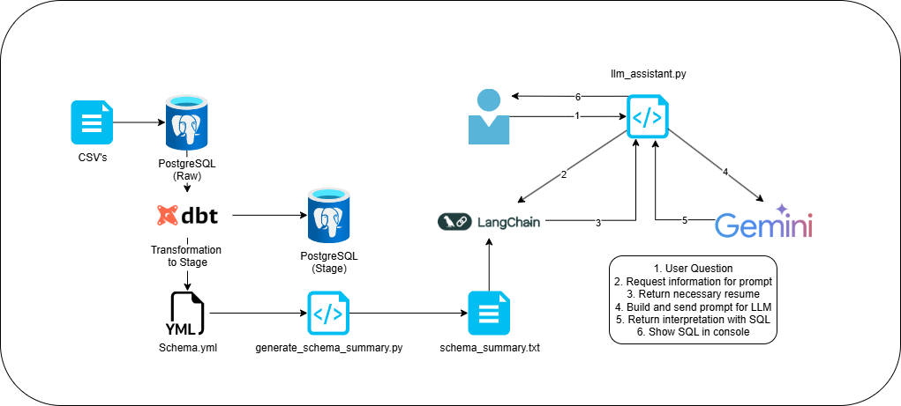

### Desafio Sofia Salud

En este desafío, se desarrollo una solución que satisface la necesidad de consultar con lenguaje natural a un asistente impulsado por LLM (**Gemini**) con el objetivo de obtener una Query compatible con el principal dispositivo de almacenamiento (**PostgreSQL**).  
Se decidió utilizar **LangChain** para generar eficiencia en cada prompt enviado por el usuario.  
Se solicitó el uso de DBT para el procesamiento de los datos almacenados en PostgreSQL.  
  
A continuación, podrán encontrar el manual de uso para los usuarios que quieran utilizar la solución.  
[How to Use - StakeHolders Documentation](HowToUse.md)
